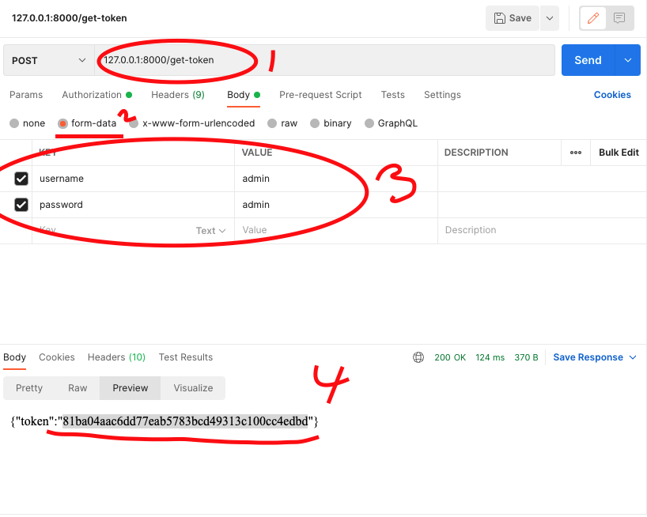
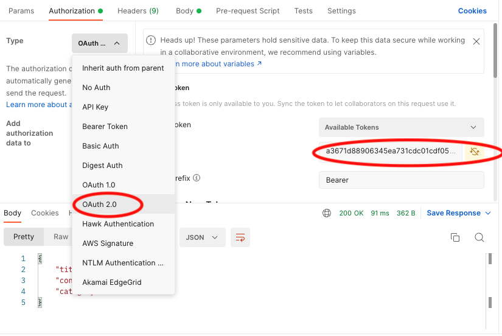
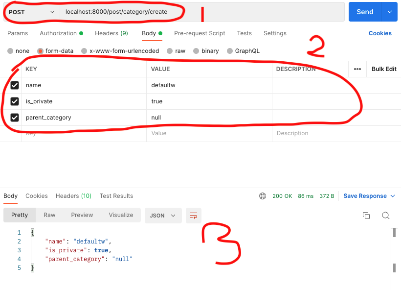

# blog/homepage dev

this project is temporary develope purpose.
don't be use it directly to your project. there may exists artifacts.
that's not my F.A.U.L.T.


# Recommended Happy Duppy Dev Tools
1. Postman // super duper query shooter and it's frreee.
2. vs-code // 
3. miniconda // help your python environment


# Authentication method
I Use Token based auth.


# setup
first, make your own environment. in my tutorial, I use miniconda.(minimal anaconda package manger)
bash```
>>> conda create -n ${your-env-name} python=3
>>> pip install -r requrements.txt
```
and let's get inside directory, type ```cd fuck```

then you finally get to start developing.

# Usage

first add user(you are admin user so, make your admin id)

bash```
>>> python manage.py createsuperuser
```
then you can create admin id

to access my django-rest-api 

make token first.

open PostMan 
get the token by using api localhost:8000/get-token

look at the numbers carefully and follow them.

if you reach number __3__, then click send. then you can get token in number __4__.


write it to your header for authentication. 
select type as __OAuth2__.
write the token string you created earlier to the access token column.



to write your first post,
you need to create category.

create category

chnage method from __GET__ to __POST__.

and in Body, fill with category name, and type of category(private : only owner can access it, public : all user allow to access it.)
, parent_category(this is optional. actually it is created for some special purpose. it doesn't need for someones. :( )


then let's write and save your first post.


